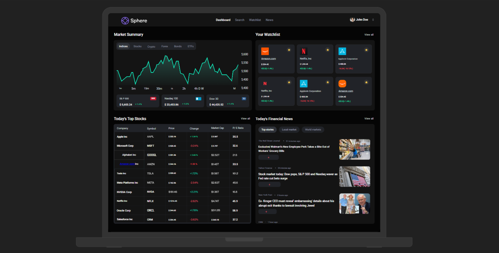

# 🌐 Sphere – AI Powered Stock Market & Alerts Platform  

<div align="center">  
  <a href="https://youtu.be/gu4pafNCXng" target="_blank">  
      
  </a>  
</div>  

<p align="center">  
  <b>Sphere is a full-stack stock market web application</b> built with <code>Next.js</code>, <code>Shadcn</code>, <code>Better Auth</code>, <code>Inngest</code>, and <code>MongoDB</code>.  
  It helps users stay on top of the market with real-time data, personalized alerts, AI summaries, and a robust admin dashboard.  
</p>  

<div align="center">  
    
    
    
    
  <br/>  
    
    
    
    
</div>  

---

## 📖 Overview  

Sphere is not just a stock tracker — it’s a **modern AI-powered trading assistant**.  
With Sphere, you can:  

- 📊 View real-time stock prices with interactive charts.  
- 🔔 Set custom alerts & notifications.  
- 📰 Read AI-generated summaries of earnings, news & sentiment.  
- 👨‍💻 Use the admin dashboard to manage users, stocks, and publish updates.  
- ⚡ Enjoy automated, event-driven workflows thanks to **Inngest**.  

---

## ⚙️ Tech Stack  

- **Next.js** → Full-stack React framework for SSR & APIs.  
- **TypeScript** → Type-safe development for fewer bugs & better DX.  
- **TailwindCSS** → Rapid UI styling with utility-first classes.  
- **Shadcn UI** → Accessible, customizable React components.  
- **Better Auth** → Authentication & authorization with support for social logins & MFA.  
- **MongoDB** → NoSQL database for scalable data storage.  
- **Inngest** → Event-driven workflows (alerts, digests, notifications).  
- **Nodemailer** → Transactional & alert emails.  
- **Finnhub API** → Real-time financial data (stocks, forex, crypto).  
- **CodeRabbit** → AI-assisted code review for PR quality.  

---

## 🔋 Features  

✅ **Stock Dashboard** – Real-time stock data with line & candlestick charts.  
✅ **Watchlists & Alerts** – Save favorites & get instant notifications.  
✅ **Company Insights** – Analyst ratings, earnings, filings & sentiment analysis.  
✅ **AI Market Digests** – Daily summaries & performance insights.  
✅ **Admin Dashboard** – Manage stocks, users & publish news.  
✅ **Event Workflows** – Background jobs for automated alerts & reporting.  
✅ **Custom Notifications** – Alerts based on watchlist & preferences.  
✅ **Analytics & Insights** – Track user behavior & engagement metrics.  

---

## 🚀 Getting Started  

### Prerequisites  
Make sure you have:  
- [Node.js](https://nodejs.org/en)  
- [npm](https://www.npmjs.com/)  
- [Git](https://git-scm.com/)  

### 1. Clone the Repo  

```bash
git clone https://github.com/your-username/sphere.git
cd sphere

```

### 2. Install Dependencies
    npm install

### 3. Configure Environment Variables
  Create a .env file in the project root:
  
    NODE_ENV=development
    NEXT_PUBLIC_BASE_URL=http://localhost:3000
    
    # FINNHUB
    NEXT_PUBLIC_FINNHUB_API_KEY=
    FINNHUB_BASE_URL=https://finnhub.io/api/v1
    
    # MONGODB
    MONGODB_URI=
    
    # BETTER AUTH
    BETTER_AUTH_SECRET=
    BETTER_AUTH_URL=http://localhost:3000
    
    # GEMINI AI
    GEMINI_API_KEY=
    
    # NODEMAILER
    NODEMAILER_EMAIL=
    NODEMAILER_PASSWORD=    


### 4. Run Development Server
    npm run dev
    npx inngest-cli@latest dev

Then visit → http://localhost:3000    
    
